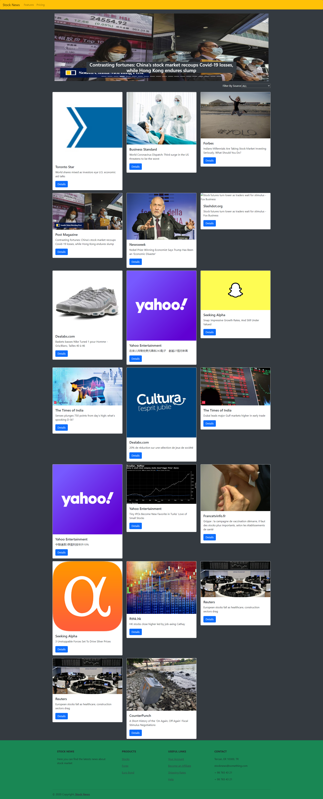

# Investit

> This is a global financial news portal. It offers a set of latest financial news from global market. Also investit enables you to view the details of each new.

## Screen Captures
 <div style="display:flex; justify-content: space-around">
  
  
 </div>

This application fetches data from financialmodelingprep news API. Investit is a single page application built with React and Redux. I use Axios to get news data and I store them in the redux store. The retrieved data can be filtered using a Filter stateless component.

## Built With

- HTML,
- CSS,
- React,
- JavaScript,
- Jest,
- Bootstrap,
- Stock News API service.

## Live Demo

[Live Demo Link](https://happy-swirles-471fcd.netlify.app/)

## Setup

-To use this app locally, 

[Download](https://github.com/SafaErden/Investit/archive/development.zip) or clone this repo:

- Clone with HTTPS:
```
https://github.com/SafaErden/Investit.git
```
- Clone with SHH:
```
git@github.com:SafaErden/Investit.git
```
- run 
``` 
npm install
```
 in the directory that you download the source.

- run 
```
npm start
```

## Author

👤 **Safa ERDEN**

- Github: [@SafaErden](https://github.com/SafaErden)
- Twitter: [@safaerden](https://twitter.com/safaerden)
- Linkedin: [SafaErden](https://www.linkedin.com/in/safaerden/)
- Mql5: [safaerden](https://www.mql5.com/en/users/safaerden)
- Email: [safaerden](mailto:safaerden@gmail.com)

## 🤝 Contributing

Contributions, issues and feature requests are welcome!

Feel free to check the [issues page](https://github.com/SafaErden/Investit/issues)

## Show your support

Give a ⭐️ if you like this project!
